# 🎓 Сайт психологической службы студентов с интеграцией HEMIS

Система психологической поддержки студентов с интеграцией в университетскую информационную систему HEMIS. Позволяет студентам проходить психологические тесты, а психологам анализировать результаты и отслеживать состояние студентов.

## 📋 Описание проекта

Это веб-приложение для психологической службы Ташкентского государственного педагогического университета имени Низами. Система предоставляет:

- **Студентам**: Доступ к психологическим тестам и личный кабинет для просмотра результатов
- **Преподавателям**: Возможность регистрации и прохождения тестов
- **Психологам**: Админ-панель для управления тестами, анализа результатов и синхронизации данных с HEMIS

## 🛠 Технологический стек

- **Backend**: PHP 8.1+
- **Архитектура**: Custom MVC (без фреймворка)
- **Библиотеки**:
  - `guzzlehttp/guzzle` - HTTP клиент для API запросов
  - `vlucas/phpdotenv` - управление переменными окружения
  - `league/oauth2-client` - OAuth2 аутентификация
  - `phpoffice/phpspreadsheet` - экспорт в Excel
- **Интеграции**:
  - HEMIS OAuth (для студентов и преподавателей)
  - OneID (государственная система авторизации)
- **Frontend**: HTML, CSS, JavaScript (vanilla)

## 🌟 Основные возможности

### Для студентов
- Авторизация через HEMIS OAuth
- Проходение психологических тестов:
  - Тест Айзенка (определение типа личности)
  - IQ тест
  - Тест Люшера (цветовой тест)
  - Методика Ранглар
  - Тест агрессии Басса-Дарки
- Личный кабинет с историей результатов

### Для преподавателей
- Регистрация и авторизация через HEMIS OAuth
- Личный кабинет преподавателя
- Проходение психологических тестов

### Для психологов (Админ-панель)
- Управление психологическими тестами
- Просмотр и анализ результатов студентов
- Статистика и аналитика по группам и факультетам
- Экспорт результатов в Excel
- Синхронизация данных с HEMIS (факультеты, специальности, группы)
- Управление преподавателями

## 📸 Скриншоты приложения

### Главная страница
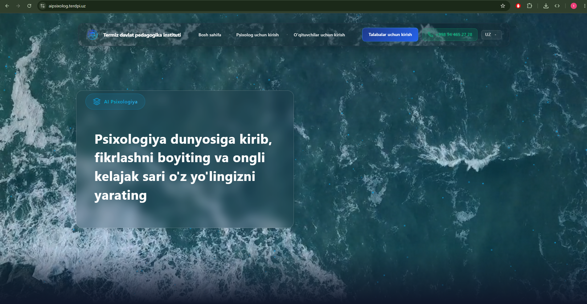
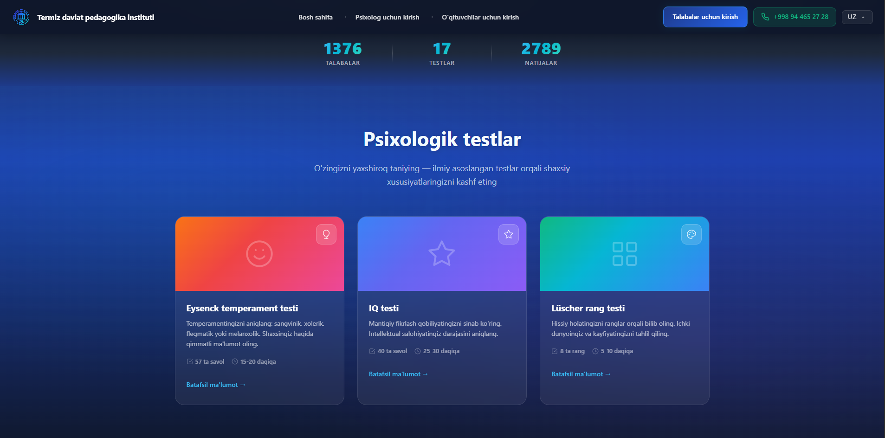
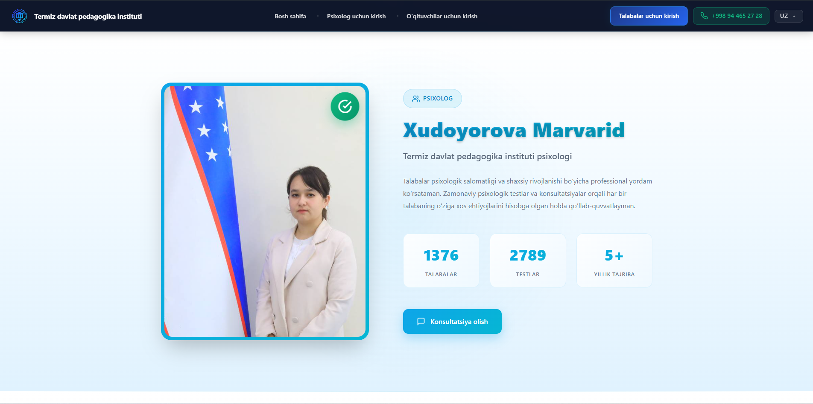
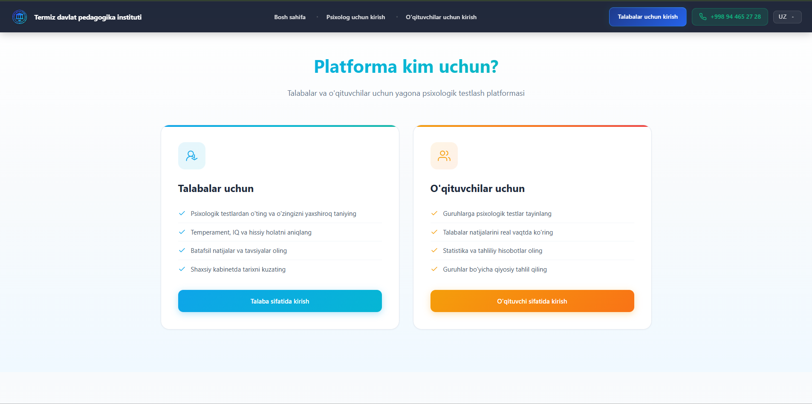

### IQ тест
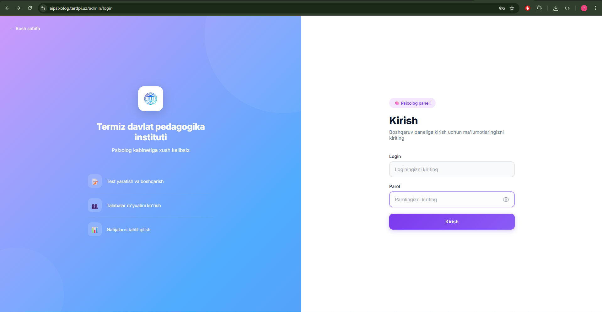

### Тест Люшера
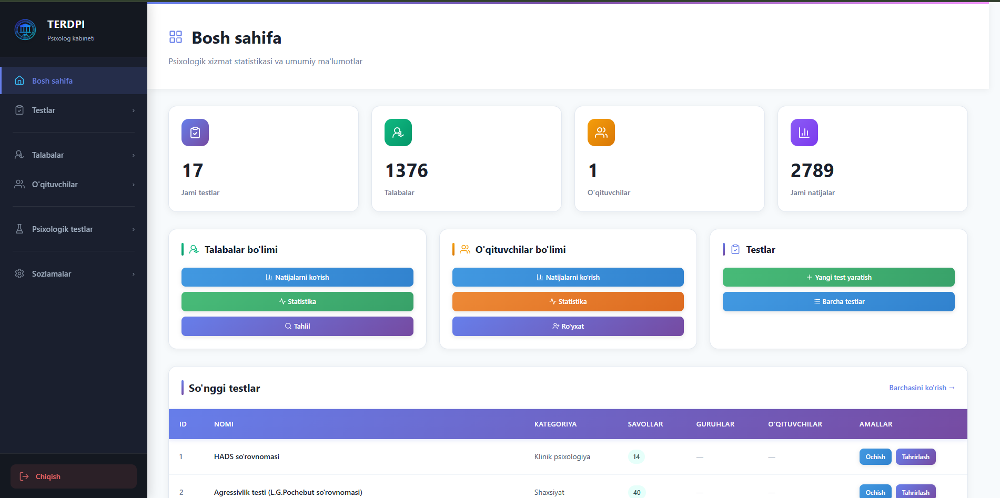
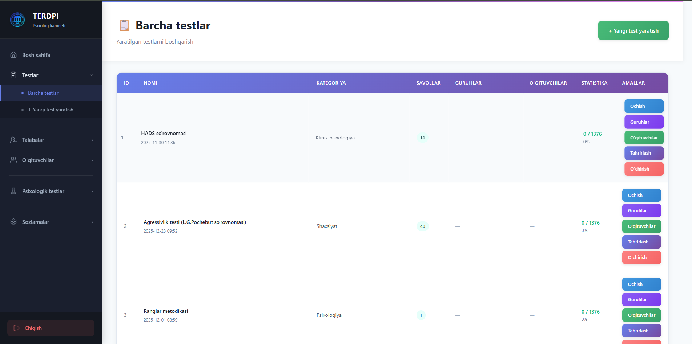

### Методика Ранглар
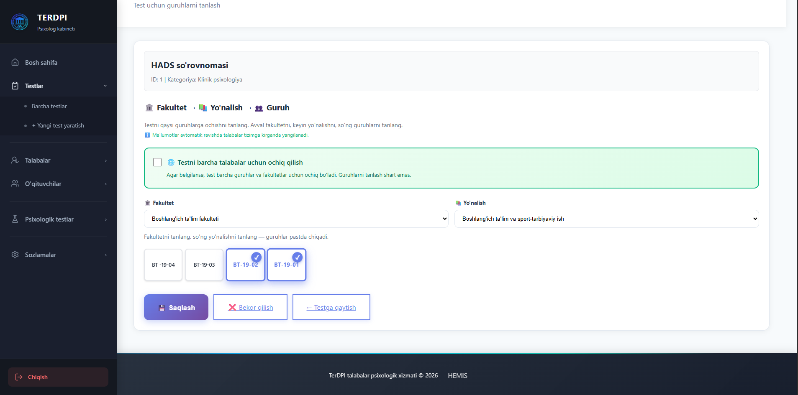

### Тест агрессии Басса-Дарки
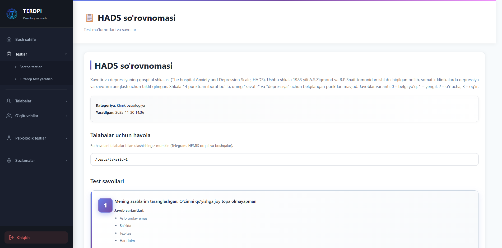
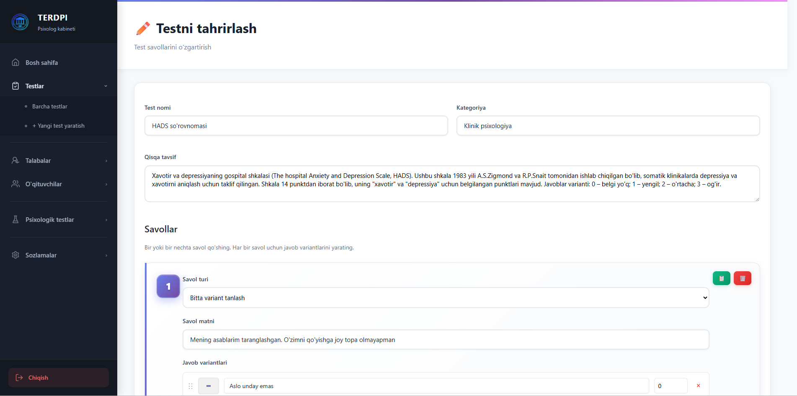

### Админ-панель
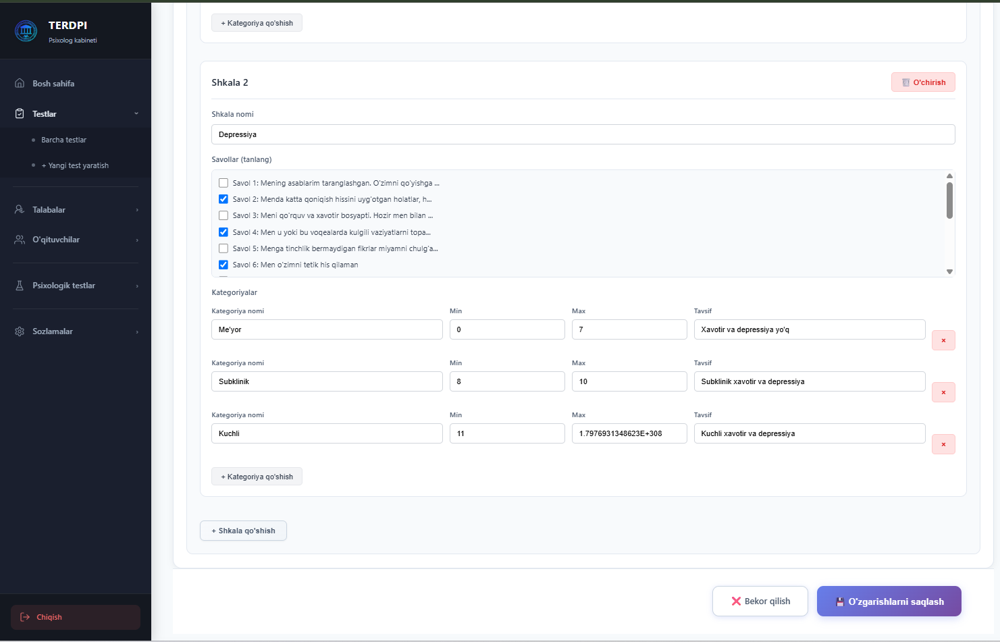
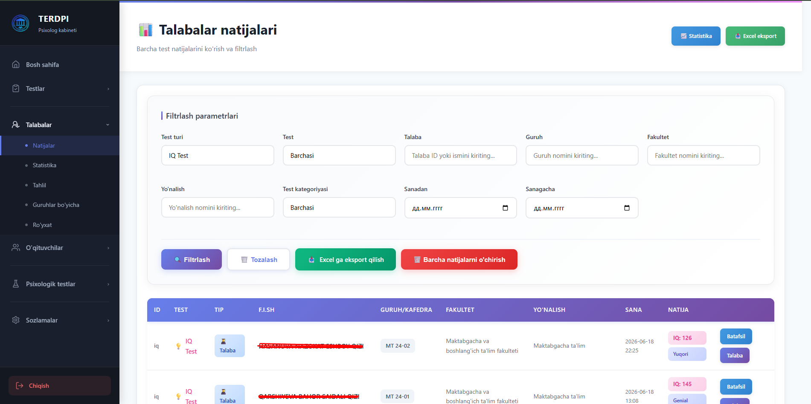
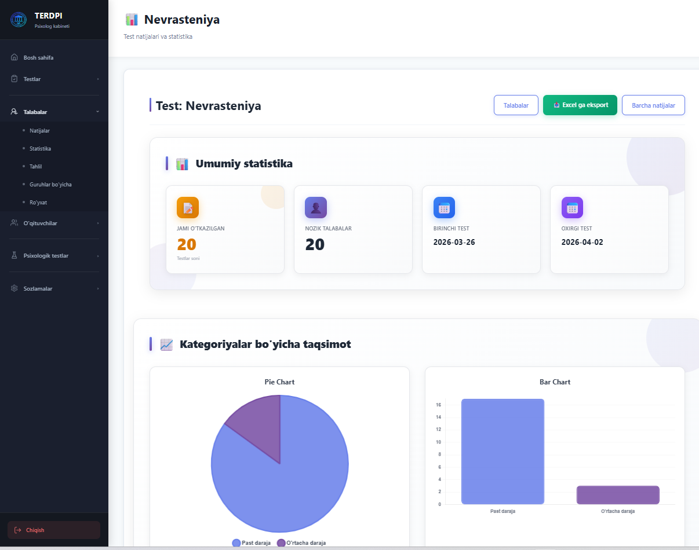
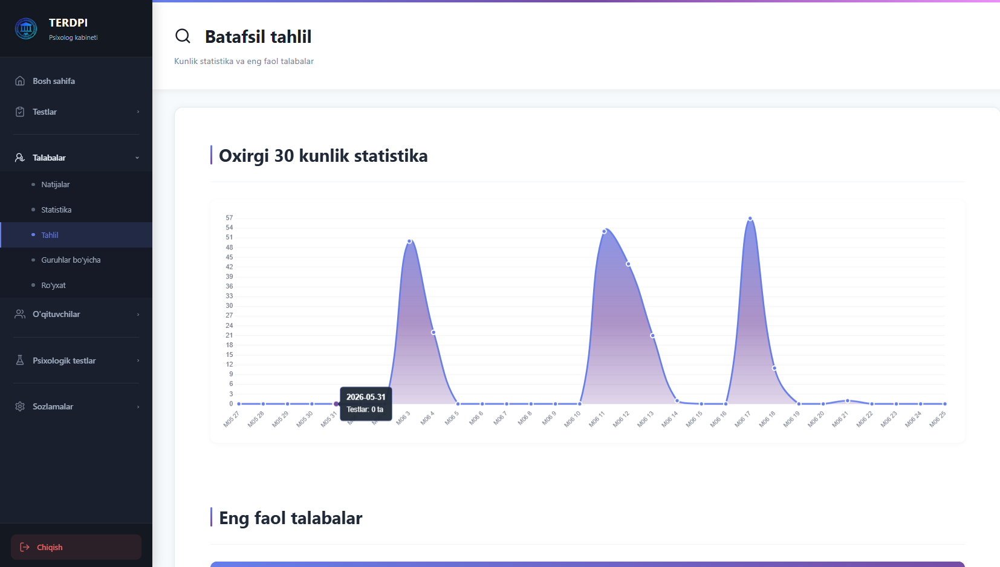

### Синхронизация с HEMIS
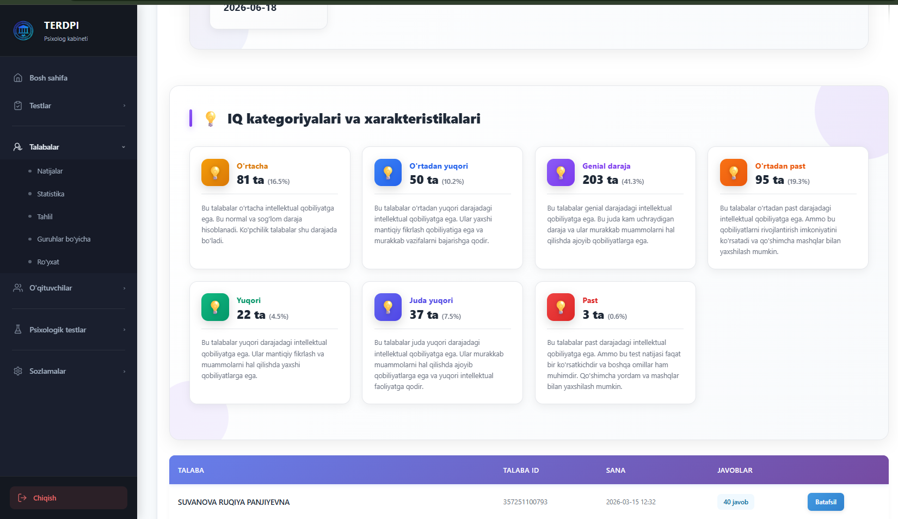

### Авторизация преподавателей
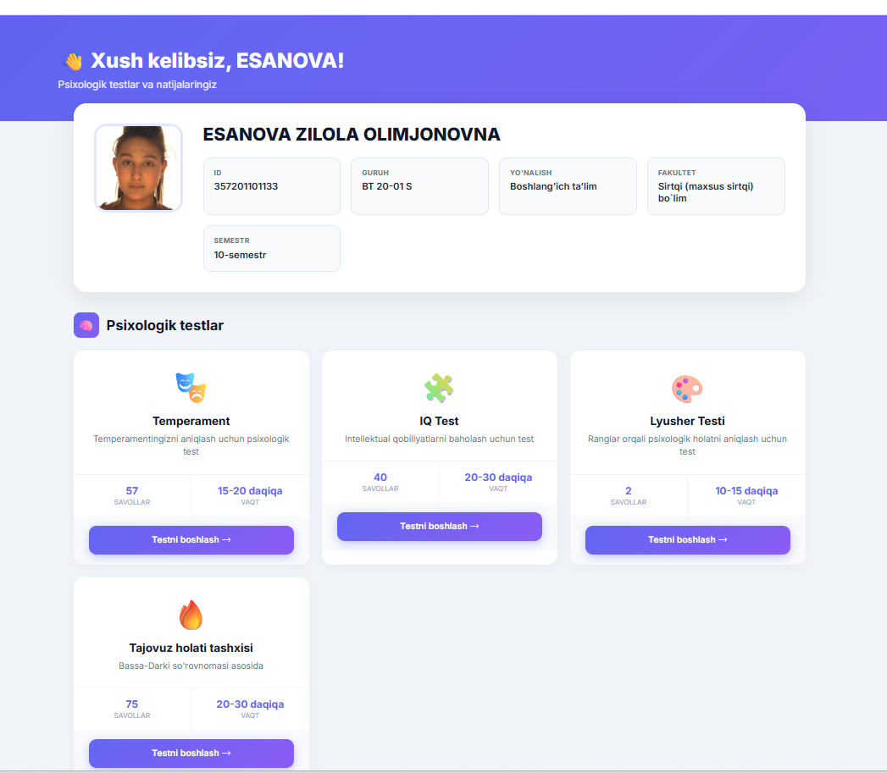
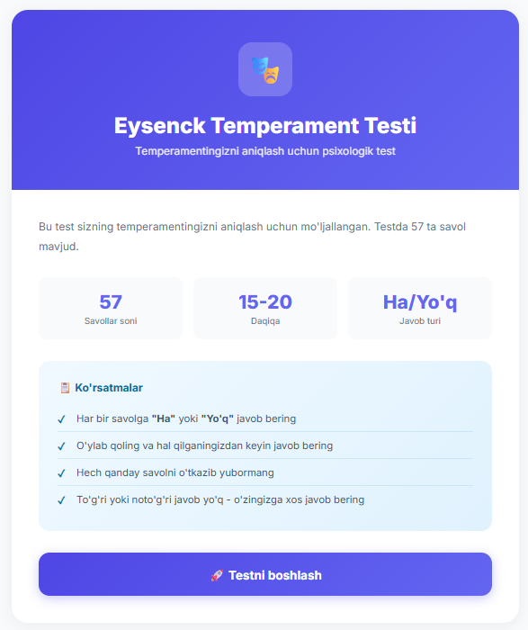

## 🚀 Установка и настройка

### Требования
- PHP 8.1 или выше
- Composer
- Веб-сервер (Apache/Nginx) или встроенный PHP сервер
- SQLite (для хранения данных)

### Шаг 1: Клонирование репозитория

```bash
git clone https://github.com/marufexpertfreelance-arch/aipsixolog.terdpi.uz.git
cd aipsixolog.terdpi.uz
```

### Шаг 2: Установка зависимостей

```bash
composer install
```

### Шаг 3: Настройка переменных окружения

Скопируйте файл `.env` и настройте его:

```bash
cp .env.example .env
```

Отредактируйте `.env` файл:

```env
# Режим работы
APP_ENV=development

# Использовать мок-данные HEMIS (для разработки)
HEMIS_USE_MOCK=false

# OAuth-настройки HEMIS
HEMIS_OAUTH_CLIENT_ID=your_client_id
HEMIS_OAUTH_CLIENT_SECRET=your_client_secret
HEMIS_OAUTH_REDIRECT=http://localhost:8000/hemis/callback/

# Адреса HEMIS API
HEMIS_OAUTH_AUTHORIZE_URL=https://student.terdpi.uz/oauth/authorize
HEMIS_OAUTH_TOKEN_URL=https://student.terdpi.uz/oauth/access-token
HEMIS_OAUTH_USERINFO_URL=https://student.terdpi.uz/oauth/api/user?fields=id,uuid,type,name,login,picture,email,university_id,phone

# Проверка SSL сертификата
HEMIS_OAUTH_VERIFY_SSL=false

# OneID настройки (опционально)
ONEID_CLIENT_ID=your_oneid_client_id
ONEID_CLIENT_SECRET=your_oneid_client_secret
ONEID_REDIRECT_URI=http://localhost:8000/oneid/callback
ONEID_AUTHORIZE_URL=https://sso.egov.uz:8443/sso/oauth/Authorization.do
ONEID_TOKEN_URL=https://sso.egov.uz:8443/sso/oauth/Authorization.do
ONEID_USERINFO_URL=https://sso.egov.uz:8443/sso/oauth/Authorization.do
ONEID_OAUTH_VERIFY_SSL=true

# Настройки для преподавателей
HEMIS_TEACHER_OAUTH_CLIENT_ID=your_teacher_client_id
HEMIS_TEACHER_OAUTH_CLIENT_SECRET=your_teacher_client_secret
HEMIS_TEACHER_OAUTH_BASE_URL=https://hemis.terdpi.uz
```

### Шаг 4: Настройка веб-сервера

#### Вариант A: Встроенный PHP сервер (для разработки)

```bash
php -S localhost:8000 -t public
```

Приложение будет доступно по адресу `http://localhost:8000`

#### Вариант B: Apache

Настройте виртуальный хост, указывающий на директорию `public/`:

```apache
<VirtualHost *:80>
    ServerName aipsixolog.terdpi.uz
    DocumentRoot "C:/Users/Maruf/Desktop/aipsixolog.terdpi.uz/public"
    
    <Directory "C:/Users/Maruf/Desktop/aipsixolog.terdpi.uz/public">
        AllowOverride All
        Require all granted
    </Directory>
</VirtualHost>
```

#### Вариант C: Nginx

```nginx
server {
    listen 80;
    server_name aipsixolog.terdpi.uz;
    root C:/Users/Maruf/Desktop/aipsixolog.terdpi.uz/public;
    index index.php;

    location / {
        try_files $uri $uri/ /index.php?$query_string;
    }

    location ~ \.php$ {
        fastcgi_pass 127.0.0.1:9000;
        fastcgi_index index.php;
        fastcgi_param SCRIPT_FILENAME $document_root$fastcgi_script_name;
        include fastcgi_params;
    }
}
```

### Шаг 5: Настройка прав доступа

Убедитесь, что следующие директории доступны для записи:

```bash
chmod -R 755 storage/
chmod -R 755 data/
```

## 📁 Структура проекта

```
aipsixolog.terdpi.uz/
├── public/                 # Публичная директория
│   ├── index.php          # Точка входа
│   ├── style.css          # Основные стили
│   ├── admin-sidebar.css  # Стили админ-панели
│   ├── images/            # Изображения
│   └── videos/            # Видео файлы
├── src/                   # Исходный код
│   ├── Controllers/       # Контроллеры
│   │   ├── Admin/        # Админ-контроллеры
│   │   ├── EysenckTestController.php
│   │   ├── IqTestController.php
│   │   ├── LusherTestController.php
│   │   ├── RanglarTestController.php
│   │   ├── AggressionTestController.php
│   │   └── ...
│   ├── Services/          # Сервисы
│   ├── Middleware/        # Middleware
│   ├── Helpers/           # Хелперы
│   ├── HemisApi.php       # API клиент HEMIS
│   ├── Router.php         # Роутер
│   └── View.php           # Шаблонизатор
├── views/                 # Шаблоны представлений
├── data/                  # Данные приложения
├── storage/               # Хранилище (логи, кэш)
├── lang/                  # Файлы локализации
├── vendor/                # Зависимости Composer
├── screenshots/           # Скриншоты приложения
├── .env                   # Переменные окружения
├── composer.json          # Зависимости проекта
└── README.md             # Документация
```

## 🔐 Настройка HEMIS OAuth

Для работы с реальной системой HEMIS необходимо:

1. Получить `client_id` и `client_secret` от администратора HEMIS
2. Настроить redirect URI в панели HEMIS:
   - Для студентов: `https://your-domain.com/hemis/callback/`
   - Для преподавателей: `https://your-domain.com/hemis/callback/`
3. Обновить настройки в `.env` файле

### Режим разработки (Mock)

Для локальной разработки без доступа к HEMIS:

```env
HEMIS_USE_MOCK=true
```

В этом режиме будут использоваться тестовые данные.

## 👤 Пользовательские роли

### Студент
- Авторизация через HEMIS
- Проходение тестов
- Просмотр личных результатов

### Преподаватель
- Регистрация через форму или HEMIS OAuth
- Проходение тестов
- Просмотр личных результатов

### Психолог (Администратор)
- Полный доступ к админ-панели
- Управление тестами
- Анализ результатов всех студентов
- Синхронизация с HEMIS
- Экспорт данных

## 🧪 Психологические тесты

### 1. Тест Айзенка (Eysenck Personality Inventory)
Определяет тип личности по двум шкалам: экстраверсия/интроверсия и нейротизм.

### 2. IQ тест
Оценка уровня интеллекта через логические задачи.

### 3. Тест Люшера (Lusher Color Test)
Цветовой тест для определения психологического состояния.

### 4. Методика Ранглар
Определение профессиональных предпочтений.

### 5. Тест агрессии Басса-Дарки
Диагностика агрессивности и враждебности.

## 📊 Экспорт данных

Администратор может экспортировать результаты тестов в Excel формат:

- Результаты студентов
- Результаты преподавателей
- Статистика по группам

Файлы экспорта сохраняются в директорию `storage/exports/`.

## 🔄 Синхронизация с HEMIS

Система позволяет синхронизировать следующие данные из HEMIS:

- Факультеты
- Специальности
- Академические группы
- Данные студентов

Синхронизация доступна в админ-панели: `/admin/settings/sync`

## 🌍 Локализация

Система поддерживает несколько языков (узбекский, русский, английский). Файлы локализации находятся в директории `lang/`.

## 🐛 Отладка

Для включения режима отладки:

```env
APP_ENV=development
```

Логи ошибок записываются в `storage/error.log`.

## 📝 Лицензия

Этот проект разработан для Ташкентского государственного педагогического университета имени Низами.

## 👨‍💻 Разработчик

Проект разработан [Maruf](https://github.com/marufexpertfreelance-arch)

## 📞 Контакты

Для вопросов и предложений по проекту, пожалуйста, создайте issue в репозитории.

---

**Версия**: 1.0.0  
**Последнее обновление**: Июнь 2026
